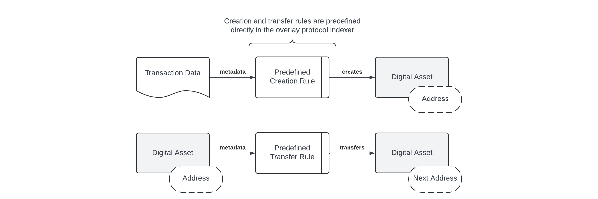
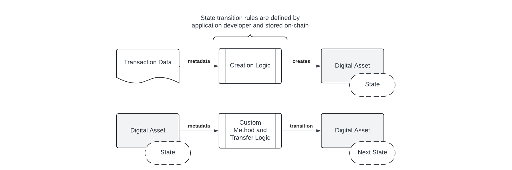

## AVM: Smart Contracts on Bitcoin by Simulating The Bitcoin Virtual Machine

**Abstract**. Until now, all overlay digital asset protocols on Bitcoin have operated according to fixed rules for the creation and transfer of digital assets. Completely flexible (Turing Complete) smart contracts can be created for overlay digital assets by allowing programmers to define state machine logic for creation and transfer rules. We propose a solution, called Atomicals Virtual machine (AVM), to enable smart contracts by leveraging Bitcoin as a global database, storing smart contract code in transactions and executing them in a sandboxed run-time via overlay digital asset indexers. The original Bitcoin Script Op Code instruction set is used as the programming language since it has all the important properties necessary for efficient execution in resource constrained environments. State hashes track the overlay transactions and provide an easy way for participants to communicate their synchronization state. The solution we present is the natural evolution of overlay digital asset protocols on Bitcoin and simultaneously serves as a testing ground for the original Bitcoin Op Codes to demonstrate their flexibility and safety.

## 1. Introduction

The Bitcoin Peer-to-Peer Electronic Cash System [1] has come to be primarily used as a store of value, so called "digital gold", with medium of exchange being a somewhat distant secondary use case. Many of the original Op Codes which are required for advanced scripting were disabled by Satoshi Nakamoto prior to his departure. The explanations offered were security reasons — in particular the avoidance of potential denial of service attacks. The removed Op Codes are maintly the arithmetic and binary manipulation operations which developers rely upon even in the most basic programming environments. Without these crucial Op Codes, Bitcoin application developers and therefore end users are limited to narrow categores of usage. Particularly important is `OP_CAT` (data concatenation) which ultimately can be used to create custom spend and carry-forward constraints called *covenants*. As a result of these past decisions, Bitcoin can *only* be digital gold and not *also* the powerful smart contract system that Satoshi Nakamoto envisioned. In other words, Bitcoin is *necessarily* "digital gold" because it is not possible to create smart contracts owing to the fact that crucial Op Codes were disabled in the hopes of protecting the nascent electronic cash system.

> “The nature of Bitcoin is such that once version 0.1 was released, the core design was set in stone for the rest of its lifetime. Because of that, I wanted to design it to support every possible transaction type I could think of. The problem was, each thing required special support code and data fields whether it was used or not, and only covered one special case at a time. It would have been an explosion of special cases. The solution was script, which generalizes the problem so transacting parties can describe their transaction as a predicate that the node network evaluates.” - Satoshi Nakamoto [2]

Various protection mechanisms have been added to Bitcoin since the Op Codes were first disabled. One such limit is MAX_SIGOPS which limits the maximum number of *Sig*nature *Op*erations allowed in any given transaction. We also have the benefit of hindsight to see how the risks of the original Op Codes have played out in the Bitcoin forks such as Bitcoin Cash and Bitcoin Satoshi Vision, both of which have reactivated the vast majority of all the original Op Codes many years ago. To date there have been no security problems, no denial of service attacks, and practically no controversy with respect to the functionality of the reactivated Op Codes. On the contrary it has resulted in a significant expansion of development possibilities on those very Bitcoin forks.

Even with the current limitations of smart contracts on Bitcoin, a number of overlay protocols have emerged that allow the creation and transfer of digital assets on Bitcoin itself using overlay protocol indexers. The first major mainstream overlay protocol was the non-fungible token standard called Ordinals, which was quickly followed by the release of a fungible token standard called BRC20. Shortly after a number of other digital asset protocols have emerged such as Atomicals Digital Objects along with ARC20, a fungible token standard which leverages the satoshi units themselves as the unit of account. Various other overlay protocols were created recently such as Bitcoin Stamps and the Runes fungible token protocol in April 2024. The current generation of these overlay protocols work largely in the same way in that data in Bitcoin transactions are used to create and manage digital assets. Overlay protocol indexers handle the tracking and lifecycle of digital assets by reading data directly from the specially marked Bitcoin transactions. What is missing in all overlay protocols is the ability for programmers to customize the behaviour of digital assets — there has not yet been a way to create smart contracts for overlay protocols until now.

We present a method to create and execute smart contracts for various overlay digital assets by simulating the Bitcoin Virtual Machine and it's Script Interpreter. The Bitcoin blockchain acts as the timestamp and data provider for smart contract programs stored on-chain, however the execution of the programs are performed by overlay protocol indexers using a sandboxed run-time. Overlay protocol indexer nodes are operated by application developers, services providers and users alike which creates a kind of emergent consensus. The concept and technique is generally applicable to any of the overlay protocols, with the appropriate modifications to their respective overlay protocol indexers.

We demonstrate the power and elegance of the original Bitcoin design. This new paradigm can serve as a testing ground for various Op Codes, albeit for digital asset overlay protocols, in the hopes that Bitcoin will eventually reactivate all of the original Op Codes, realizing the ultimate potential of Satoshi Nakamoto's creation.

### 2. Bitcoin as Global Database

The Bitcoin network is fundamentally a distributed timestamp server designed for the purpose of solving the double spend problem. More generally the design of the system lends itself for the transmission and storage of more than mere monetary transactions. In fact, explicit features were included for the express purpose of storing data such as invoices and large files. Satoshi Nakamoto included various Op Codes such as `OP_RETURN` to allow arbitrary data attachments and `OP_PUSHDATA4` which allows data pushes up to 4 Gigabytes in size.  Even the very first Bitcoin transaction called the *Genesis Coinbase Transaction* included textual data: *"The Times 03/Jan/2009 Chancellor on brink of second bailout for banks"*.

Throughout the years there have been numerous attempts to discourage using Bitcoin as a data storage medium by restricting the maximum push data size to 520 bytes and limited the `OP_RETURN` payload size to 40 bytes (later expanded to 80 bytes). Indeed it was portrayed as an attack vector and would lead to runaway "blockchain bloat" that would crowd out pure monetary usages. It seemed like a reasonable protection mechanism at the time. 

In recent times, the Bitcoin developers introduced Segregated Witness (SegWit) and the Taproot upgrades which effectively reintroduced the capability to store larger volumes of arbitrary data similar to the early versions of Bitcoin. The opportunity was quickly seized by application developers to leverage Bitcoin as the immutable global data ledger. The market for digital assets on Bitcoin has grown exponentially to billions of dollars of market capitalization and has generated hundreds of millions of dollars in network fees paid to miners in a relatively short period of time.

### 3. Overlay Protocols

Hal Finney introduced and predicted the emergence of "overlaying other protocols onto Bitcoin" that would leverage Bitcoin as a global, decentralized, and consistent database for digital assets. The basic idea is to signal the creation of overlay assets and associate data with a particular transaction history. It adds another dimension to Bitcoin as monetary system, in that the transaction outputs themselves can represent any other type of digital asset such as tokens, credits, digital media — even proxies for claims over physical assets.

> "In discussion on the BitDNS thread I came up with an idea for overlaying other protocols onto Bitcoin. From one point of view, Bitcoin is a global, decentralized, yet consistent database. This DB is used to record transfers of coins, but it could potentially be used for more. There are many applications for a global consistent database.
>
> Borrowing from my BitDNS description, the way this would work is we would use the mysterious and extravagant "scripting" system to add additional data to regular Bitcoin transactions. These would look like NOPs to current clients and be ignored, but overlay aware clients would look inside this NOP block and see the extra protocol-specific data, and interpret it according to the overlay protocol.
>
> Specifically i could imagine using OP_NOP1 to signal overlay data, then OP_PUSHDATA to push the specific data, then OP_DROP to drop it from the stack, followed by the regular tx opcodes. This will have no effect on regular clients and look like a regular transaction (can be a dummy tx, 0.01 to yourself) but overlay aware code sees a protocol transaction.
>
> As an example, Bitcoin could be used as an inexpensive timestamp service, allowing you to prove that a certain document existed on or before a certain date. All you need to do is create a dummy transaction to yourself, and hack the client to do an OP_PUSHDATA of the hash of the document, then OP_DROP it. The hash will be around for all time in the block chain and stand as proof that the document existed at that date." - Hal Finney [3]

The first overlay protocol that has achieved significant adoption is Ordinals Theory. It is described in the Ordinals Handbook: *"Individual satoshis can be inscribed with arbitrary content, creating unique Bitcoin-native digital artifacts that can be held in Bitcoin wallets and transferred using Bitcoin transactions. Inscriptions are as durable, immutable, secure, and decentralized as Bitcoin itself."* 

Shortly after the growth of Ordinals, developers recognized the need for a fungible token standard on Bitcoin and therefore the BRC20 standard was created to address that need. BRC20 leveraged Ordinals Theory to create an overlay account model that would be associated with wallet addresses and be able to send and receive token units, essentially creating a layered *overlay protocol* on top of Ordinals Theory, which itself being an overlay protocol on top of Bitcoin.

Later in 2023, another protocol called Atomicals Protocol Digital Objects was created to address the growing market need of token standards and indexing technology. It is described in the Atomicals Guidebook: *"The Atomicals Protocol is a simple, yet flexible protocol for minting, transferring and updating digital objects (traditionally called non-fungible tokens) for unspent transaction output (UTXO) blockchains such as Bitcoin. An "Atomical" is a way to organize the creation, transfer and updates of digital objects – it is essentially a chain of digital ownership defined according to a few simple rules.*".  The Atomicals Protocol includes a fungible token standard called ARC20 which has the unique property that each unit of a token is backed by at least 1 satoshi unit and operates according the the same rules of sending and receiving Bitcoin itself using the unspent transaction output (UTXO) architecture.

By early 2024 another overlay protocol called Runes was released, which was implemented directly in the Ordinals indexer to complete the Ordinals Theory to finally include a fungible token standard.

### 4. State Machines

All of the overlay protocols on Bitcoin thus far have been based on fixed or predefined state machines. All overlay protocols share in common essentially two state machines: one for signalling the creation of digital assets and the other for governing the transfer of those digital assets. The state machine rules are essentially unchangeable and hard-coded in their respective overlay protocol indexers — application developers have no way to customize digital asset behavior.

What is needed is a way for application developers to define the creation and transfer lifecycles of their digital assets. We present a model of dynamic state machine programming that allows application developers to fully customize and define arbitrary rules for their digital assets. 

The basic idea is to allow developers to put their smart contract code in the data segments of transations to make available for all parties to execute. By having the code stored on the blockchain, it is easy for different parties to synchronize state by executing the logic in the same way. The smart contract programming language should the following key properties at a minimum:

- Predictable run-time
- Arbitrary flexibility -  Turing Completeness [4]
- Efficient execution on resource constrained systems

From the above requirements, we see that Bitcoin Script lends itself very well to being such an instruction set to define creation and transfer rules of digital assets. Virtually any type of rule should be made possible, while also limiting the execution time to prevent denial of service attacks —which essentially amounts to avoiding infinite loops. Bitcoin Script is now generally acknowledged to be Turing Complete, being a Two Stack Pushdown Automata (2-Stack PDA) and has the benefit of not having any looping instruction, but can achieve the same effect as loops using the technique of loop unrolling. Therefore, it has the special property that the run-time of a program is linearly proportional to the size of the program itself.  

Smart contract program code is stored in Bitcoin transactions and overlay protocol indexers execute the code for the various method calls and state transitions. All interested parties execute the same logic and arrive at the identical state transitions, which forms an emergent consensus. 

### 5. State Consensus

Synchronization of state can be achieved using a state hash which communicates the internal state of an overlay protocol indexer to each other and to external observers. By publishing state hashes for each block, it is easy for various parties to assess whether they are following the same rules and whether they have arrived at the same state with respect to each other. 

There is no need for a complex state commitment scheme because all data is on stored on chain and timestamped in chronological order, allowing anyone to arrive at the exact same state. This scheme reflects the Bitcoin ethos "Don't trust, verify" in that each user can validate the entire Bitcoin blockchain and therefore ascertain the states of all smart contract programs.

### 6. Virtual Digital Assets

Any overlay protocol can adopt this dynamic state machine programming technique and allow digital assets to be virtualized into and out of smart contracts. In essense, it means we can create the concept of deposits and withdraws as a matter of convention, since after all everything else is already a matter of convention that depends on the complete historical record of transactions on the blockchain being used to build up the indexer states. We discuss two kinds of virtualization below: account-based and UTXO-based.

With BRC20 the token balances are account abstractions and can be described as a type of virtual digital asset - a digital asset on top of a digital asset (Bitcoin). Atomicals ARC20 tokens are abstractions that maintain an affinity to the underlying satoshi units themselves, but nonetheless are also a type of virtual digital asset. These are more accurately termed "virtual digital assets" because their existence is an abstraction on top of another digital asset (Bitcoin).

To create virtual account-based abstraction, we can define a state machine which accepts any type of token to be deposited *into* the contract and can later be *withdrawn*, similar to how the Ethereum blockchain's Solidity programming language permits methods to be annotated as *payable* to indicate that Ether may be paid to that method and later withdrawn according to the rules of the smart contract program. The tracking and management of these digital assets could be done with special Op Codes such as `OP_FT_WITHDRAW` and `OP_NFT_WITHDRAW` and a mechanism for *payable* methods to accept tokens inside the smart contract state. 

Building upon the account-based abstraction, it is possible to define protected smart contract memory that can only be written to by the contract itself. Recall that Atomicals Digital Objects already provides a general purpose key-value storage for non-fungible tokens, we can define a memory space that can only be written to using special key-value storage access Op Codes such as `OP_KV_GET`, `OP_KV_EXISTS`, `OP_KV_DELETE`, and `OP_KV_PUT` for retrieval, existence, deletion and write access respectively. This storage technique elevates smart contracts on Bitcoin to a similar level of functionality as the Ethereum blockchain.

Another approach from an enitrely other angle is what we call the virtual UTXO (vUTXO) architecture. The virtual UTXO architecture basically adheres and respects the chain of transaction output-spends and binds an output to a specific locking script, which can only be unlocked by providing a valid unlocking script. This effectively creates a virtual overlay UTXO-set that is stored and managed in the overlay protocol indexers, allowing complete freedom for virtual digital asset developers to all the limitations of the limited instruction set provided by Bitcoin miners. The main caveat is that there must be an expiry time, refresh policy, and an eviction strategy for handling stale vUTXO to prevent the overlay protocol indexer state from becoming too large. 

### 7. System Architecture

To ensure the consistent execution of smart contracts, the AVM interpreter runs in a sandboxed environment which is called by the host indexer. In this way different host indexer programming languages and environments can more easily achieve consensus compatibility by having a canonical way to execute scripts.

The sandboxed interpreter is a stripped down version of the Bitcoin Script Interpreter with some notable differences such as accepting the execution locking script (scriptPubKey) and the unlocking script (scriptSig) directly along with the various other data such as token state and protected memory snapshots. 

### 8. Conclusion 

We have proposed the Atomicals Virtual Machine (AVM), a smart contract system for overlay digital assets on Bitcoin by simulating the Bitcoin Virtual Machine. Up until now, overlay digital assets on Bitcoin were governed entirely by predefined state transition rules: allow nothing more than the creation and transfer of those digital assets. To solve this, we proposed a general technique to allow smart contracts by leveraging Bitcoin as a global database and storing smart contracts in transactions for the execution in a sandboxed run-time via the overlay digital asset indexers. The original Bitcoin Script instruction set is sufficiently capable and powerful because it is a 2-Stack PDA and has been proven to be Turing Complete. By using state hashes, it is easy for participants to validate that indexer states are synchronized correctly. The system is flexible enough and a natural evolution of existing overlay protocols and demonstrates the tremendous capability of the original Bitcoin Script and Virtual Machine.

### References

[1] Satoshi Nakamoto, "Bitcoin: A Peer-to-Peer Electronic Cash System" https://bitcoin.org/bitcoin.pdf, 2008.

[2] Satoshi Nakamoto, "The nature of Bitcoin is such that once version 0.1 was released, the core design was set in stone for the rest of its lifetime...", https://satoshi.nakamotoinstitute.org/posts/bitcointalk/126/, 2010.

[3] Hal Finney, "In discussion on the BitDNS thread I came up with an idea for overlaying other protocols onto Bitcoin...", https://bitcointalk.org/index.php?topic=2077.msg26888, 2010.

[4] Wikipedia contributors. "Turing completeness." *Wikipedia, The Free Encyclopedia*. Wikipedia, The Free Encyclopedia, https://en.wikipedia.org/wiki/Turing_completeness, 2024

### Disclaimer 

This document does not constitute an investment, promise, warranty, guarantee or contract of any kind. The authors, developers, and copyright holders DO NOT warrant the software for any purpose. Atomicals and the Atomicals Virtual Machine (AVM) are both general purpose techniques for transparently tracking digital assets on the Bitcoin and UTXO based blockchains. Anyone is free to adopt and use the technique for their legal and lawful purposes provided the relevant jurisdictions permit the creation and use of such software.

There are no tokens officially associated with "Atomicals Virtual Machine" "AVM". THERE ARE NO FORMAL OR IMPLIED RELATIONSHIPS TO ANY TOKENS. Any similarly named tokens are expressly not associated with the Atomicals Virtual Machine creators, developers, and copyright holders.

THE SOFTWARE IS PROVIDED "AS IS", WITHOUT WARRANTY OF ANY KIND, EXPRESS OR IMPLIED, INCLUDING BUT NOT LIMITED TO THE WARRANTIES OF MERCHANTABILITY, FITNESS FOR A PARTICULAR PURPOSE AND NONINFRINGEMENT. IN NO EVENT SHALL THE AUTHORS OR COPYRIGHT HOLDERS BE LIABLE FOR ANY CLAIM, DAMAGES OR OTHER LIABILITY, WHETHER IN AN ACTION OF CONTRACT, TORT OR OTHERWISE, ARISING FROM, OUT OF OR IN CONNECTION WITH THE SOFTWARE OR THE USE OR OTHER DEALINGS IN THE SOFTWARE. THE SOFTWARE DOES NOT REPRESENT ANY INVESTMENT, SECURITY, SHARE, FINANCIAL INSTRUMENT, REDEMPTION, PROMISSARY NOTE, BEARER INSTRUMENT OR COMMITTMENT OF ANY KIND.

### Thank You to All Supporters

The following names and messages are included as a Thank You to all supporters. There were no payment nor purchase requirements and no other requirements to have a message included below other than to voluntarily submit a name and/or message. It is our show of gratitude to everyone and we inscribe and immortalize their support. The messages belong to their respective owners. The message contents below are not endorsed by the authors or developers and are strictly the sole property of those person(s) who submitted their messages. There is no utility, nor future roadmap, nor future usage of the messages below except to acknowledge their support.

**List of supporters (in no particular order):**

Concord, Massachusetts

shadow: keep building

+thomasp

芭比金刚: 我们共同见证，崭新的加密时代. 我们和atomicals站在一起

El1contreras

DateDiver: Decentralization and community unity. We will build together on the protocol and make history within the Bitcoin blockchain.⚛️ 

+kuniter: Long Live Atomicals

Wizz: Coloring The Bitcoin, Programming The Future

ArlynsCryptoTrader: No existe valor mas importante que la Libertad - There is no value more important than Freedom

josephbm_btc: Muy contento y agradecido por ser parte de este proyecto deseo muchos éxitos en todo lo que hagan bendiciones

nicolasgpcr

bejar

julianbb

ZZQ: Web3 world will remember what's we achieved. Love you all my family.

Andrés Quiros Valverde

Anonymous: Ξthos **₿** : no race, no skin, only love

Howe: Best wishes to Atomicals and always believe it will make a revolution in the BTC ecosystem.

AlexV525

Anonymous: EVO will be a dynasty

FireKun: DAOs will be the building blocks of future human civilization. The Realm Name system is the best platform for creating DAOs. Thanks to Atomicals, Bitcoin is great again!

灰太狼吉哥Nakamoto: If you don't believe me or don't get it, I don't have time to try to convince you, sorry.

Disco Quotidie: live w/ bitcoin

CESARDATA: MAMÁ LO LOGRÉ!

DragonCapsule loves Atomicals

Dennis@MetaFoxes

baihe455

CripVtor: Manuel desde El Salvador: La libertad no tiene precio, el desarrollo de la AVM marca un antes y un después en Blockchain

KIANG: Atomical protocol ha llegado a colorear un mundo centralizado y monocromático

money3315: Atomicals is a great invention! I firmly believe that it can go further and grow taller! Good luck to us!

Anonymous: 大山梦

Zhang Q

+atomshuttle

+web3er

see222: 道阻且长，行则将至

see111: 不啻微茫，造炬成阳

木子: 功不唐捐，玉汝于成

阿科: 浮生若梦，为欢几何

陈陈: 荜路蓝缕，栉节沐风

小白菜: 大音希声，大象无形

Anonymous: 温柔半两，从容一生

Anonymous: 乾坤未定，你我皆是黑马

Anonymous: 工贵其久，业贵其专

Anonymous: 坚持不懈，终将成功

Anonymous: 勇敢追梦，无所畏惧

Anonymous: 信心是成功的关键

Anonymous: 踏上征程，追寻光明

Anonymous: 梦想是行动的起点

Anonymous: 坚持与激情，点燃希望之火

Anonymous: 无畏前行，成就梦想

Anonymous: 勇敢迈出第一步，未来即刻展开

Anonymous: 每一次的尝试都是通向成功的桥梁

Anonymous: 希望是前行的动力，坚持是抵达目的地的关键

Anonymous: 创业之路不止于目的地，更在于沿途的风景

Anonymous: 困难不是终点，而是通往成功的必经之路

Anonymous: 行动胜过一切，梦想因行动而生

Anonymous: 挑战是成长的阶梯，勇气是攀登的力量

Anonymous: 成功的种子，播种于不断努力的土壤

Anonymous: 明日之花，源自今日的耕耘

Anonymous: 不放弃，不止步，前行的路上皆是希望

Anonymous: 创业路上，每一步都在接近成功的彼岸

Anonymous: 我诚 路自稳.

Anonymous: 山高路远 只看自己.

Anonymous: 做野花 做千千万万.

Anonymous: 不讨好不迎合不够讨喜但自由.

Anonymous: 我爱舒服的晚风自由的灵魂.

Anonymous: 路上见识自己 途中认清自己.

Anonymous: 无心风月 独钟自己.

Anonymous: 若无共呜 沉默即安.

Anonymous: 先自沉稳 而后爱人.

Anonymous: 泛交不如独往

Anonymous: 做自己的灯塔

Anonymous: 边清零边拥有

Anonymous: 越山 阅书悦己

Anonymous: 偏见是无知的产物

Anonymous: 关注内心 远离喧嚣

Anonymous: 做让人远远听见的风

Anonymous: 步伐一致的人不会走散

Anonymous: 知足知不足 有为有不为

Anonymous: 欲成大树 莫与草争

Anonymous: 别听建议 听听自己

Anonymous: 心静则淡泊 不争则宽松

Anonymous: Build A Vibrant Metaverse on Bitcoin，原神启动⚛️

Manupe: AVM, This is the way

Issam: Kash said it,776 lucid on top d'ici 2027 je suis loin d'ici

songkan: 有格局的项目方

innocente.eth: Congratulations AVM

Anonymous: ATOMICAL IS BITCOIN'S FUTURE. COME ON.

Anonymous: Atomicals，请再次伟大

D10S

POWERFEI

cyber牛

BridgeHoleCap: Hello,Atomicals

haifeng: 因为相信，所以看见!

Jackie: we are with you

Anonymous: Empty your minds,Be formless shapeless, like water. Water can flow or it can crash, be water,it is very slow and you push it out, running water never grow stale. All the time you are keeping the continuity going.

April: like water

Skyler

a16886

Sixologist: Make Bitcoin great again!

fly_higher: salute to Idealism / 向理想主义致敬

ChaseCalleja

Arren亚刃: Atom changes the world and my life

voyager_zh: Make Atomicals Great Again!

tiedyedmt

F.F: Make Bitcoin Great Again

AndyJiang: I love ATOM

Alp2a: Make Atomicals Great Again!

DannftTc: keep going！！ LFG ！！

misscryptochen: always supports magic Atomicals!

cybex888

+blueark: Can't wait for AVM to launch and shake up the ecosystem! Let's do this!

SuperL9

Blueee: Hopefully something more interesting will happen.

freeusa.eth: Always support Atomicals ⚛️

ChengGong: For atomicals, For builders!

Yixin

btcdayu-hpk: Atomical will be very hot fast!

lxcong.eth: make bitcoin great again

tang430

wiki: will make Bitcoin and the Atomicals protocol great again! Let's build the BIT civilization together!  

0xMatsu: Make colored coin great again!

Ghezzi

Peter Logan: New Era

taooz1: AVM UP！

ffromer: 希望ARC20做大做强，为比特生态做出更大的贡献

LaPLoD: 衷心祝愿atomicals协议能够成功，也祝福一切理想主义者能够成功。 best wishes to atomicals protocol and all idealist

lorryxiong: Realize Satoshi Nakamoto's vision

aimierbear

Web3英语每日一句

luoran

blockpunk2077

NextDAO: NextDAO 🤝 Atomicals

Anonymous: 理想主义者终将取得胜利✌️

BoxMrChen and Collider: Make Atomicals Greate Again!

猫弟: Atomicals 是普通人最值得参与的比特币生态，没有之一

bandeng917

Kumata: For the future.

fishermengz

pinetworks.eth: atomicals is the best protocol of the 21st century

0xSea.eth: Make Bitcoin Great Again.

oz: Groundbreaking work has not only set a new benchmark but also inspires a future filled with limitless possibilities. Congratulations on this monumental achievement.

atomtoothy: we will always support Atomicals ⚛️

Allin0543: All IN ATOMICALS

+yon: Make Bitcoin Great Again.

+falcon: Atomicals, Quark, LFG!

PigBlockchain: 高老庄

phekda: God bless idealists.

+ivanoror: Thanks for everything.

0xFish

Xingkong.sats

Kika Wang: this is my ice cream money, for something cool

julian: mfer

gaohongxiang: Love Atomicals! Love AVM!

GanRy.x: 有意思比有意义本身更有意义.

Kar1kar1: Long live Atomicals

jessecai33: Make BTC Turing Complete

0xsimon: The road not taken makes all the difference.

Mr.Zhang: Atomicals grow at light speed!

0xshowhandism

suntoshi: Many hands make light work. WAGMI

SJTU trm: difference is value

yan: 我们的贡献，如同河流汇入大海，虽微不足道，却是不可或缺的一部分。每一份支持，都在推动着人类社会向前发展，证明了我们对技术进步的坚定信念。愿我的小小努力，能够汇聚成推动世界前行的力量。

MonicaSchm55590: 比特币让中华文化焕新生,Bitcoin makes Chinese culture great again.

0xwuming

sharp

taro: 遨游九霄

XBTC2008: Atomical Bombs are sparking a major explosion in BTC world.  

0xMatsu: Make colored coin great again!

奈斯: love atomicals.

江天霸: 历史上伟大的瞬间如同天上的繁星，而我们有幸化身为其中一颗，共同在宇宙的画卷上留下独特的轨迹。

0xNoVoice: Looking!The blitz loop this planet to search way.Only my Atomicals can shoot it.

Adolfo Cz: Oro Atomico

snow of pluto: 比特币是一个自我实现的预言。Make Bitcoin magical again !

Xinyue Zhang

Sixologist: Make Bitcoin great again!

Chevy: Marico ya tu viste lo que esta haciendo

Krito: I love Atomicals

silencezq: 肝 

0xfish

laobo: The crypto world is the greatest innovation and it’s fascinating

xiaobai

渣渣

Gouer: Support Atomicals LFG

石头: 再次让比特币光芒万丈

lzz96

Terrific: 8888

Gagus: 1974第一次在东南亚打自由搏击就获得了冠军…

Long

btctian 

0xJeremy: avm can definitely create miracles!

ash: Atomicals will be immortal with Bitcoin.

+dragon: I love AVM

+snake: Make BTC great again!

brandontruely: petit à petit, l'oiseau fait son nid.

痴大飞: I LOVE CT.

QuarksLand: Welcome to Quarks Land! Make Atomicals great again!

bravo_6688: make atomicals immortal

诺米: you know what M3

DannylovesDoris: In Atomicals we trust!

ocram857

Zach

EHMJ: may god bless me to be rich

lake: hello_world_hello_avm

clickbinary: NOTHING BUT RICH

DJ: quark It’s about time!

BTC2035: AVM is BEST

DAVTYAN ARA 

DDD: IKUZO 衝 冲

spaceline

tanz: The end of infinity is a new beginning.

Fairy Mo: Fairy Mo doesn't care 

marcjoe

barra

mikey: 价值有边际，模因无上限

小球

撸噜子『華文道』: 比特币让中华文化焕新生,Bitcoin makes Chinese culture great again.

maybe7093948

AmyWang: Bring Bitcoin to the next level，原神启动⚛️

blurmaggie: keep building!

守得云开见月明: Just do it and make Atomicals better and better -berry

QuarkToDaMoon: No1 meme coin in BTC ecosystem

Sankin: I think one token for one sats and bitwork are the most attractive features of the Atomicals protocol.

Dreworld

0xshushu

haiyu

胡翌霖『華文道』: 比特币让中华文化焕新生,Bitcoin makes Chinese culture great again.

Tanshui: Everything is becoming interesting; the 'singularity' of the Bitcoin ecosystem has emerged.

Fernando torrico mariscal: thanks to be real all the time.!!!!

dynamox: believe in something

Thread: AVM makes BTC great again

ckw: 原子协议一统天下

+csrf: Lezhi+Emma+CSRF^_^

Leaper: This time, we are truly witnessing the ultimate innovation on Bitcoin—Atomicals are the answer to everything.

Joel Bodden: Living the Satoshi Nakamoto's Dream and be part of History of The AVM

MrVinPH, CPA: Contributing to Atomicals Protocol for the advancement of bitcoin and future success!

bitsky738: Love and Peace

老飘

Kuncle: Brother Han, is it really impossible to become an immortal cultivator without a spiritual root?

Teng: AVM unlocks infinite possibilities.

守得云开见月明: Go Big or Go Home—Berry

infinity: AVM makes Atomicals Protocol great!

Mosqu1to: The Atomicals protocol will change the world, so do I.

Jony He: 希望#Atomicals成为比特链上最主流的协议，为币圈打开聪的世界,最终实现万链归一. #Atomicals Protocol ⚛️ will make Bitcoin great again 05/26/2024

曼巴肘击

korou: Freedom and fairness are a movement, Bitcoin is the future!

Hernan H: Ser parte de esto es hermoso.

YIDASHI: 26.5.2024:daochiyiyou

Nahuel Pumari: Thanks to my family, Nicolas, Laura, Jorge, I love you.

KitoShi: no dejes de vivir por miedo a morir.

ahmed alsayadi

H.H: El brillo de los colmillos sobre las escamas de las gran serpiente... D10s existe y es atómico.

Coinwar: Unete a epicas batallas

Jaime: Success is not final, failure is not fatal: It is the courage to continue that counts

XEUG: Idealist,rock forever,102LDCB!

TommyDavis: Viva la Atomicals

Rudy.H: Pour toi mon fils JULIAN.H Tu es la plus belle chose qui me soit arrivée sur cette terre chaque moment avec toi est un cadeau précieux. Que la force, le courage et l'honneur soit dans ton coeur mon fils. Je t'aime.  PAPA MERCI AVM 

vico: 天之道，损有余而补不足。

you jianzuo: Smart contract on BTC coming.

xsh: AVM makes Bitcoin greater.

lanxinr: Bitcoin and AVM will drive the world towards greater fairness, transparency, and freedom.

chirsj: congrats to come to the real world

siriusye: Mastering Satoshi-level manipulation is essential for Bitcoin's success. Atomicals will further enhance Bitcoin's potential. We are poised to witness an exciting future.

Nucleus

Karo Espiritu: Building for the future of cryptos.

Manuel Gómez

Franky: Nadie conoce qué nos deparará el futuro y poder enfrentarnos a él de forma exitosa puede resultarnos complicado en determinadas ocasiones.viva la libertad carajooo.

hehaifeng: Because of belief, one sees.

Erol Bodden: Expendiendo el universo de Bitcóin.

+Kelin: Atom makes BTC truly great!

+MrBWG: Great Bitcoin,Great Atomicals!

+kamen: Thanks Atomicals for contributing to the BTC ecosystem and changing my life.

kiroashi: nanmubagayalu

Peng Xia: Xiaoju Wang and Ruilin Xia，I love you forever!

Swee: Buy Bitcoin, own future.

wanghao

lushuguang: Lu Yi and Wang Hongfen are in good health and live long lives

李寒寅: web3 to the moon

Lu Qun, Yuan Yuqi: Yuan Xinyao finds a good job and marries a good wife

ele_crypto: Developing is improving the growth of any project

Daniel Rodriguez: I'm very happy to participate in this project, I'm from Argentina. VLLC!

Agustín Rodríguez: I believe in this project! Love you guys from Argentina

阿蒙: 祝愿一切都顺利

Terrific:1691888

Flybull

Neo188: To Be Healthy & Wealthy!

Anonymous: 给年轻人一个机会

Banana: World is a frozen banana.

云鹏

Liberty Cats

Wanning: Freedom

Stone: Let Bitcoin shine again

Jianing: Bitcoin is Forever.

rengoku.sats/+rengoku: Set your heart ablaze.

0xrodger: Atomicals will open up a new world for Bitcoin

Techjoy: The future belongs to the crypto. And the Bitcoin ecosystem will play an important role in the future.

STRICH Gauthier: Merci pour cette révolution ⚛️

Lorry Xiong: To make bitcoin a world computer

DINGJIANZHONG: 100408220923

Zhining: Love and Peace

北方: ATOM使BTC变得更伟大、更完善。

Dailos, a Canario from '82 who was at the birth of one of the greatest milestones of humanity ARC-20, I love Ana, the best mother in the world, without you nothing would have been possible, Thank you.

Tanz: Love Rice and Tammy forever and infinitely.

Kambo: I love my family, With Atomicals Protocol ,BTC will more greater!

苏苏: 为自由而战

ChengGong: Wishing Atomicals all the best for the future.

Less-23 huguesib: Bitcoin is complete. thanks to atomicals.

rupertgy: At this moment, you are witnessing history, the creator of miracles, Atomicals！ If you don't believe it, I don't have time to explain

liangaonb: Atomicals makes bitcoin great again!

Le Sauveur: D'une une vision éclairée qui mérite la plus haute admiration, à des perspectives inestimables pour Bitcoin et au-delà.

to1dev: Bitcoin is our homeland!

LaMachina: Thank you, for your dedication and ingenuity. Atomicals brings the color that Bitcoin was lacking to fully realize its potential. We are witnessing a remarkable advancement that will undoubtedly leave a lasting mark on the history of the timechain. Thank you immensely.

Ehook: Blockbeats

AnyNodes: Building a Decentralized World

Estyven García Zapata: Atomicals Virtual Machine mi llave a la libertad! 

石榴园_曙光村小学

chuqian: 人生得意须尽欢，莫使金樽空对月。天生我材必有用，千金散尽还复来。

MLRDKZT: All my admiration and gratitude for his ingenuity and diligence. They say we dream in color. Now, we Bitcoin in color. Thanks.

Tedchang112: Atomicals will be the most popular FT protocol on Bitcoin!!!

fanzj: Believe Atomicals !

Florent: From the Atom to the Infinity

Peng Xia: Xiaoju Wang and Ruilin Xia，I love you forever!

承彦: 让虚拟货币生态再次伟大

 撸噜子『華文道』: 比特币让中华文化焕新生,Bitcoin makes Chinese culture great again.

nicrain: Salute to the developers with ideals and capabilities, the world is different because of you!

大头: 原子协议让比特币更伟大

PengPeng: My love: Beryl,Mia and Bitcoin!

zhx295023: Make Atomicals Greate Again!

crazy4answer: Let's make the history

Mian_

老东: Atomicals fight till the end

Zoe Wang

+Crypto CY: Together We Build History

x.闻: 原子协议——永远伟大，永远热泪盈眶

Otomo_Sai@NextDAO

stopstopgogo: BTC OG

风筝: wish for better

李子建

EddieWen89: Atomicals will lead the crypto world

axu: Pay tribute to the great blockchain decentralization spirit,atomicals

LIYU: Always be optimistic, always stay positive and upward

Valody: 海市蜃楼虽幻境，乘风破浪仍向前(Although the mirage is illusory, it is still moving forward in the wind and waves.)

dayhon

出头之日: 2024Arc20带我自由飞翔！

海蜇: Make Bitcoin Great Again.

Hercules__Bg: The beginning.

_cyberkaiser: Thank you

⛲⚡🐕: Of course we will witness the rise of an era

xianshengV: Black Hole

Quarkduck: Color Quark, Color Atomicals!

sunlighthy: Let us witness the greatness of Atomicals together!

btc100w 张健

flreey

Hatom: Atomicals brings BTC to a new history.

ManuelitoNunes: Estamos a las puertas de una nueva era, estoy muy agradecido por ser parte de esto. Thank U ARC-20. ⚡️

Faridcinho: Un pequeño paso para mí, un gran paso para la humanidad.

孤云将军: 孤独是一个人的狂欢，狂欢是一群人的孤独。

chaojimiaomiao: Healthy, happy, rich.

Undersea research: Find something undervalued

pengfei: i love arc20，i love quark！

s.: Congrats on the AVM whitepaper release! We're about to see a new future for the Bitcoin mainnet. Infinite possibilities.

HappilyNorth: But the fruit of the Spirit is love, joy, peace, forbearance, kindness, goodness, faithfulness, gentleness and self-control. Against such things there is no law.

大队长: 似真似假的朋友过眼云烟，刻进区块的誓言才是永远
